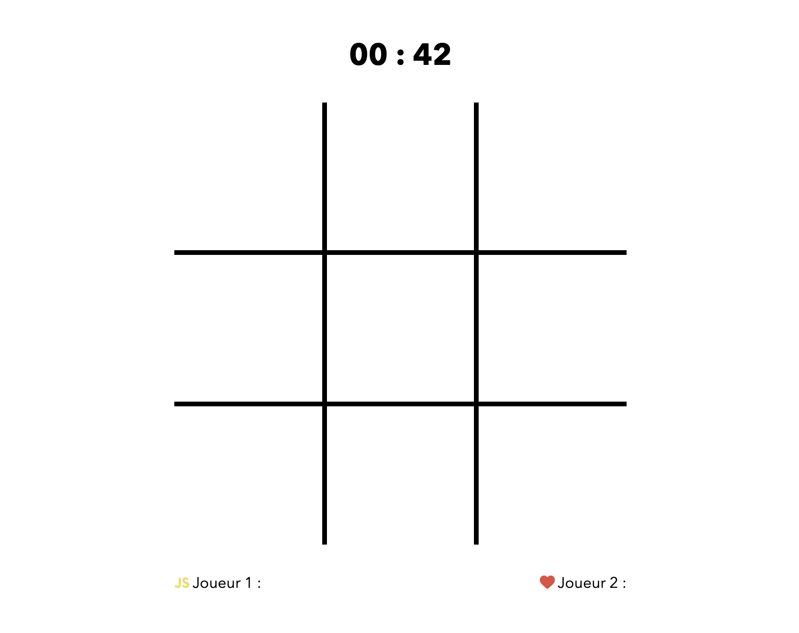
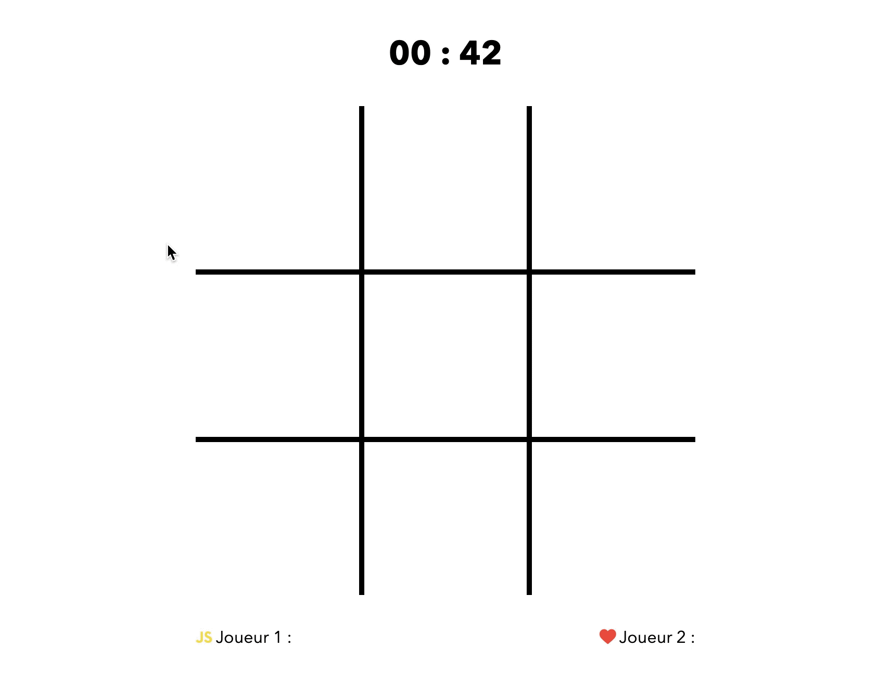

# Tic Tac Toe

> Examen DCC janvier 2020-2021

Dans le cadre de cet examen, nous vous demandons de reproduire une version simplifiée du jeu Tic-Tac-Toe aussi connu sous le nom OXO. Le but est de remplir une ligne, colonne ou diagonale d’un même symbole dans une matrice de taille fixe, ici 9. Le jeu sera joué par une seule personne qui placera alternativement des JS et des ♥️.

## Consignes pour l'examen

1. Renommez le dossier qui se trouve sur le bureau de votre machine qui porte le nom `examen-dcc-janvier-2020-2021` en `examen-dcc-janvier-2020-2021-nom-prenom-group`.
1. Dans le cadre de cet examen de *Développement Côté Client* vous devez uniquement vous focaliser sur le fichier `index.js`, qui se trouve à la racine. Mis à part ajouter la balise `script`, on ne vous demande pas de modifier le code html ni le code CSS qui s'y rapporte.
1. Cet examen dure maximum 4 heures.


## Les données

1. Créer une classe `Player` qui contient au moins une propriété qui représente le score du joueur.
1. Définissez une constante qui contient le temps maximal que prendra une partie.
1. Stockez dans un conteneur approprié 2 instances de la classe Player.
1. Stockez dans un conteneur approprié les 2 éléments `.result_item result_item--love` et `.result_item result_item--js` afin de pouvoir facilement modifier leur contenu. Ces 2 éléments contiennent respectivement le score du joueur JS et love.
1. Définissez une variable globale qui vous permet de connaitre le joueur courant.

## Préparer le plateau de jeu

1. Commencez par ajouter à l'élément racine `html` la classe `js-enabled` à l'aide de JavaScript.

1. Retirez du document html l'élément `.no-js__message`.

1. Générez 9 items de liste à l'élément portant l'identifiant `app`. Voici le code HTML d'un l'item.

    ```html
    <li class="grid__item"></li>
    ```

1. Affichez dans l’élément `.timer` le temps maximal d’une partie. Notez que vous devez convertir les secondes en un couple (minutes, secondes) pour permettre l’affichage "01:40" si la durée maximale est égale à 100 secondes. 100 secondes c’est équivalent 1 minute et 40 secondes.



## Jouons un peu

Dans cette seconde partie, nous vous demandons de programmer le jeu

1. Quand le joueur clique pour la première fois sur un `grid__item` vous ajoutez à cet élément la classe `grid__item--js`. Ainsi l'item devient

    ```html
    <li class="grid__item grid__item--js"></li>
    ```

1. Mettez à jour le score du premier joueur.  

1. Dès que le joueur a cliqué, vous devez enclencher le compte à rebours.

1. Quand le joueur clique pour la deuxième fois sur un autre `grid__item` vous ajoutez à cet élément la classe `grid__item--love`.

    ```html
    <li class="grid__item grid__item--love"></li>
    ```

1. Mettez à jour le score du deuxième joueur.

1. Maintenez cette alternance de coups. Une fois JS une fois love.

1. Enrichissez l’expérience utilisateur en ajoutant la classe `js` à l’élément `.grid` si c’est au tour de `JS` et `love` si c’est au tour de love de jouer, cela permet d’avoir un effet au survol de la grille. Veillez à n'avoir qu'un seul modificateur de classe à la fois. Soit `grid js` ou `grid love`.

1. Affichez le nouveau score du bon joueur.



## Ajoutons des règles

1. Il n'est pas permis de changer la valeur d'une case. Quand on clique sur une case déjà jouée, le joueur perd 1 point.
1. Dès que le conteur tombe à 0, le jeu se termine et personne n'a gagné.
1. Détectez lorsque le joueur a placé une ligne, une colonne ou une diagonale de coeur ou de js. Dans quel cas vous connaissez le gagnant !
1. Si le plateau de jeux est rempli, mais que personne n'a gagné alors le jeu se termine aussi

## Terminer le jeu


1. Si le joueur gagne avec une ligne, colonne ou diagonale de *JS* alors vous devez charger le formulaire 

```html
<form class="play-again-template_form" method="get">
  <p class="play-again-template_form__message"><span class="play-again-template_form__message__winner play-again-template_form__message__winner--js">js</span> a gagné !</p>
  <input class="btn play-again-template_form__submit" type="submit" value="Jouer à nouveau !">
</form>
```


1. Si le joueur gagne avec une ligne, colonne ou diagonale de *love* alors vous devez charger le formulaire 
```html
<form class="play-again-template_form" method="get">
  <p class="play-again-template_form__message"><span class="play-again-template_form__message__winner play-again-template_form__message__winner--love">love</span> a gagné !</p>
  <input class="btn play-again-template_form__submit" type="submit" value="Jouer à nouveau !">
</form>
```

1. Si le joueur perd par manque de temps ou car toutes les cases sont remplies alors vous devez charger le formulaire 

```html
<form class="play-again-template_form" method="get">
  <p class="play-again-template_form__message">Le jeu est perdu</p>
  <input class="btn play-again-template_form__submit" type="submit" value="Jouer à nouveau !">
</form>
```


## Bonus 🥳 1

Organisez votre code de sorte à pouvoir recommencer infiniment. Si js perd alors c'est love qui commence la prochaine partie. Veillez à ne pas soumettre le formulaire, ce qui impliquerait de recharger la page.

## Bonus 🥳 1

Dans le document HTML se trouvent 3 templates JavaScript qui contiennent chacun un formulaire différent. Dès lors, vous pouvez améliorer le point précédent en chargeant le bon formulaire à l’aide de la méthode importNode(). Attention, cette méthode retournera le formulaire si vous lui passez le bon sélecteur, il n'est pas encore inclus dans l'arbre du document. Pour ce faire, vous devez appeler une méthode telle que insertAdjacentElement().

1. Si le joueur gagne avec une ligne, colonne ou diagonale de *JS* alors vous devez charger le template `.play-again-template--js`
1. Si le joueur gagne avec une ligne, colonne ou diagonale de *love* alors vous devez charger le template `.play-again-template--love`
1. Si le joueur perd par manque de temps ou car toutes les cases sont remplies  alors vous devez charger le template `.play-again-template--lost`

